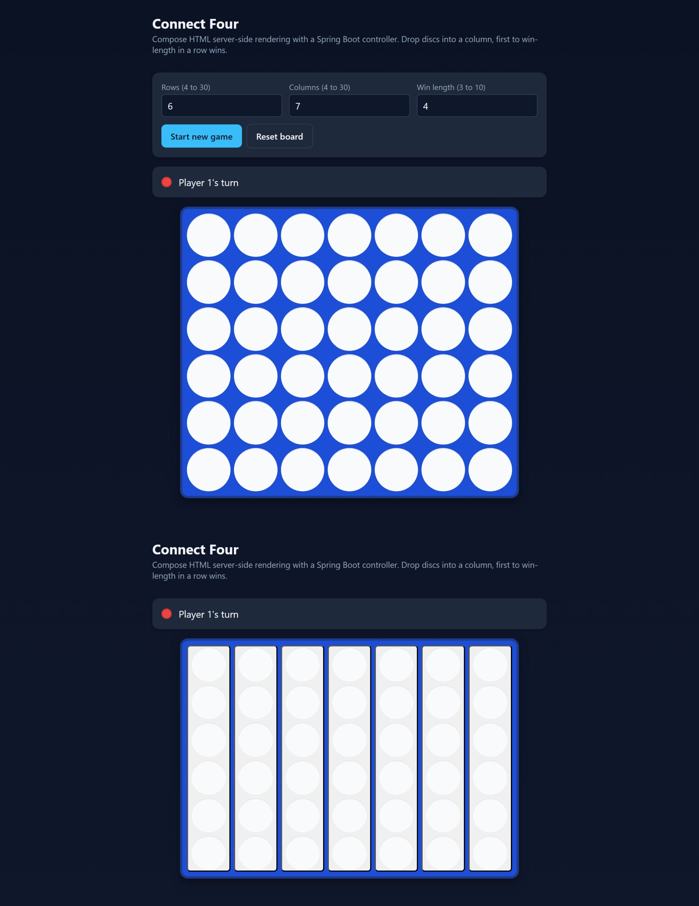

# Connect Four, Compose HTML SSR for Spring

[](https://github.com/lmnst/compose-html-spring-ssr-connect4/actions/workflows/ci.yml)


```kotlin
fun interface View<T> { fun render(model: T): HtmlNode }

object ConnectFourView : View<ConnectFourView.Model> {
    override fun render(model: Model): HtmlNode = html { /* board, status, form */ }
}

val pageHtml: String = DocumentRenderer(ConnectFourView, layout).render(model)
```

A Kotlin Multiplatform Connect Four built around a small generic
SSR engine. Spring renders HTML on the JVM, the browser hydrates
that same DOM via Compose HTML, and the same view function is the
only renderer for either path. The shape is conventional: a Spring
controller plus a server-rendered page. The value is in one
decision the design refuses to bend on.

> **The invariant.** The server holds the canonical state of every
> game in its repository, keyed by an opaque id. Moves are applied
> by the same pure engine the client runs, but the engine consults
> repository-owned state, never a state field on the request body.
> A no-JS player can tamper with form fields all day; they cannot
> forge a board, fast-forward turns, or resurrect a finished game.



> The same game rendered twice. Top: JavaScript on, Compose HTML
> has hydrated and added the configuration panel. Bottom:
> JavaScript off, the page is plain SSR HTML where each column is
> a single `<button>` and clicks submit a form. Both produce the
> same canonical state in `InMemoryGameRepository`.

## Table of contents

- [Highlights](#highlights)
- [Run it](#run-it)
- [Anatomy of a request](#anatomy-of-a-request)
- [The generic SSR engine](#the-generic-ssr-engine)
- [Library use](#library-use)
- [Endpoints](#endpoints)
- [Tests](#tests)
- [Build](#build)
- [Project layout](#project-layout)
- [Limitations](#limitations)
- [Reading on](#reading-on)

## Highlights

- **Generic SSR engine.** `DocumentRenderer<T>` renders any `View<T>`
  in a complete HTML5 document. The Connect Four view is one
  client of it; the welcome page at `/about` is another.
- **Server-authoritative state.** `InMemoryGameRepository` is the
  canonical record of every active game, keyed by an opaque
  `GameId`. The form posts only the column the player clicked.
  No hidden state input means no tampering surface.
- **No-JS playable.** With JavaScript disabled the page renders a
  real `<form action="/games/{id}/move">` and each column is a
  `<button name="col">`. Submits become server moves through
  classic post-redirect-get; refreshing the result page does not
  resubmit.
- **Cross-target hydration codec.** `StateCodec` is dependency-free
  Kotlin in `commonMain`, exercised by both `commonTest` on the
  JVM and `StateCodecJsTest` on the compiled JS target so the
  embedded payload provably decodes the same way in the browser.
- **Spring without `bootJar`.** The Spring Boot Gradle plugin is
  not applied (it does not compose with Kotlin Multiplatform
  variants). `bootRun` is a small `JavaExec` task that runs
  against the JVM jar plus the JVM runtime classpath.
- **Compose without leakage.** The Compose compiler runs only on
  the JS target (`composeCompiler.targetKotlinPlatforms`), so
  neither the Compose runtime nor any browser API leaks into the
  shared engine in `commonMain`.

## Run it

```bash
./gradlew bootRun
```

```bash
$ curl -i http://localhost:8080/
HTTP/1.1 303 See Other
Location: /games/m9k3qr1xs7
Cache-Control: no-store

$ curl -sL http://localhost:8080/ | head -c 240
<!DOCTYPE html><html lang="en"><head><meta charset="UTF-8" /><meta name="viewport" content="width=device-width, initial-scale=1.0" /><title>Connect Four, Compose HTML SSR</title><link rel="stylesheet" href="/static/connect4.css" />
```

A single move through the no-JS path:

```bash
$ ID=$(curl -sI http://localhost:8080/ | awk -F'/games/' '/^[Ll]ocation/ {print $2}' | tr -d '\r')
$ curl -i -X POST -d "col=3" "http://localhost:8080/games/$ID/move"
HTTP/1.1 303 See Other
Location: /games/m9k3qr1xs7
Cache-Control: no-store

$ curl -s "http://localhost:8080/games/$ID" \
    | grep -oE 'application/x-connect4-state" id="[^"]+">[^<]+'
application/x-connect4-state" id="connect4-initial-state">v1|6|7|4|TWO|O|.....1.|5.3
```

The trailing `5.3` is the row and column of the disc that was just
placed (zero-indexed; the bottom-right corner is `5.6`). The
`TWO|O` says it is now Player 2's turn and the game is ongoing.

The same pipeline serves a non-game page through the same engine:

```bash
$ curl -s http://localhost:8080/about | grep -oE '<h1>[^<]+'
<h1>Compose HTML SSR for Spring
$ curl -s http://localhost:8080/about | grep -c 'application/x-connect4-state'
0
```

`/about` shares the renderer, the layout primitives, and the test
suite. It does not share a model, a state embedding, or a JS
bundle. That is the shape the engine is meant to take.

## Anatomy of a request

Three pieces of code make the invariant load-bearing rather than
aspirational. The flow is also drawn at controller-level detail
in [ARCHITECTURE.md](ARCHITECTURE.md#request-flows); a one-screen
sketch:

```
Browser  ----- GET / ----->  Connect4Controller.root
                             GameService.create(config)
                               InMemoryGameRepository.create(state) -> GameId
Browser  <-- 303 /games/{id}
         ----- GET /games/{id} ----->
                             GameService.load(id) -> GameState
                             PageRenderer.render(model)  // SSR HTML + state script
Browser  <-- text/html (board playable already; no JS required)

Browser  ----- POST /games/{id}/move col=N ----->  Connect4Controller.applyMove
                             GameService.applyMove(id, col)
                               repo.update(id) { ConnectFourEngine.move(state, col) }
                             MoveOutcome:
                               Applied      -> 303 /games/{id}
                               Rejected     -> 200 same page + inline error
                               GameNotFound -> 404
Browser  <-- (follows 303 with GET /games/{id} for the new state)
```

### Server-authoritative repository

`InMemoryGameRepository` keeps every active game's `GameState` in a
`ConcurrentHashMap`, keyed by a `GameId` of 10 random characters
drawn from `[a-z0-9]` (36^10 ~= 3.7e15 ids; collisions are
negligible and the repository retries up to eight times anyway).
Mutations go through `ConcurrentHashMap.compute`, so a
refresh-and-submit race against the same id serializes at the map
entry; different ids never block each other. The id is the only
handle the client ever has on a game; the controller validates it
through `GameId.from`, returning 404 with a friendly body for
unknown or malformed ids.

### Post-redirect-get loop

The board is wrapped in a real `<form action="/games/{id}/move"
method="post">` and each column is a `<button name="col" value="N">`.
With JavaScript disabled, every click is a plain HTML form
submission. `Connect4Controller.applyMove` reads the column out of
the form, calls `GameService.applyMove(id, col)`, and dispatches on
a sealed `MoveOutcome`:

- `Applied` returns `303 See Other` with `Location: /games/{id}`.
  The browser follows up with a GET, so refreshing the result page
  never re-submits the move.
- `Rejected` (full column, game already over) re-renders the same
  page with an inline error and a 200 response. The repository
  state is untouched.
- `GameNotFound` returns 404.

`GameService.applyMove` is the only place a move runs. It loads
the canonical state from the repository inside an atomic
`compute`, calls `ConnectFourEngine.move`, and stores the result.
The engine is pure Kotlin in `commonMain`, so the same function
runs in the browser without modification.

### Hydration boundary

`DocumentRenderer<T>` writes the body view inside
`<div id="root" data-ssr="1">` and emits a sibling
`<script type="application/x-connect4-state">` carrying the
encoded `GameState`. On startup the Compose HTML client reads
that script through `StateCodec.decode`, then mounts a Compose
tree at `#root` that produces the same DOM the server emitted,
but now driven by Compose state instead of HTML form
submissions. From mount, column clicks update local Compose
state; a hard refresh returns to the server's view of the world.

The codec is dependency-free Kotlin in `commonMain` and is
exercised on **both** targets: a `commonTest` suite and a
JS-target `StateCodecJsTest`, so the SSR-embedded payload
provably decodes the same way in compiled JS as it does on the
JVM.

## The generic SSR engine

The engine is **not** Connect-Four-shaped. The Connect Four demo
is a small bundle of types layered on top of it.

```kotlin
// Generic, reusable, in commonMain/connect4/ssr
sealed interface HtmlNode { /* Element, Text, Fragment */ }
fun html(block: HtmlScope.() -> Unit): HtmlNode    // type-safe DSL
class HtmlRenderer(pretty: Boolean = false)        // emits well-formed HTML

fun interface View<T> { fun render(model: T): HtmlNode }
data class DocumentLayout(val title: String, /* assets, lang, meta */)
fun interface StateEmbedding<in T> { fun encode(model: T): EmbeddedState? }
class DocumentRenderer<T>(
    view: View<T>,
    layout: DocumentLayout,
    stateEmbedding: StateEmbedding<T>? = null,
)

// Connect-Four-specific, in commonMain/connect4/view
object ConnectFourView : View<ConnectFourView.Model>
object WelcomePageView : View<WelcomeModel>        // proves genericity
class PageRenderer(...)                            // typed wrapper over DocumentRenderer
```

| Type | Role |
|---|---|
| `HtmlNode` | Sealed AST: `Element`, `Text`, `Fragment`. Tag names validated at construction time. |
| `HtmlRenderer` | Depth-first emitter. Escapes text and attribute values. Replaces `</` with `<\/` inside `<script>` and `<style>` raw-text contexts so a payload cannot break out. |
| `View<T>` | Pure function `T -> HtmlNode`. Platform-agnostic, deterministic, no platform deps. |
| `DocumentRenderer<T>` | Wraps any `View<T>` in a complete HTML5 document defined by `DocumentLayout`. Optionally plugs in a `StateEmbedding<T>`. |
| `StateEmbedding<T>` | Optional state embed: produces a `<script type="...">` block placed next to the root mount. |

## Library use

The engine is the same code path whether you render Connect Four,
the welcome page, or a future view. `AboutController` is the
shortest possible proof:

```kotlin
data class WelcomeModel(val heading: String, val intro: String, val bullets: List<String>)

object WelcomePageView : View<WelcomeModel> {
    override fun render(model: WelcomeModel): HtmlNode = html {
        div(class_ = "app") {
            h1 { +model.heading }
            p(class_ = "subtitle") { +model.intro }
            ul { for (b in model.bullets) li { +b } }
        }
    }
}

val renderer = DocumentRenderer(
    view = WelcomePageView,
    layout = DocumentLayout(title = "About", styleHref = "/static/connect4.css", scriptSrc = null),
    stateEmbedding = null,            // no client bundle, no hydration
)
val html: String = renderer.render(WelcomeModel("hello", "world", listOf("a", "b")))
```

A new view is a model, a `View<T>`, and a `DocumentLayout`. A new
hydratable view also supplies a `StateEmbedding<T>`. Everything else
is the engine.

## Endpoints

| Method | Path | What it does |
|---|---|---|
| GET | `/` | Create a new game and `303` to `/games/{id}`. Optional `rows`, `cols`, `win` query params; invalid combinations fall back to the default 6x7-with-4 config. |
| POST | `/games` | Form-create a new game with the same params. Same redirect. |
| GET | `/games/{id}` | Render the SSR page for a game. 404 with a friendly body if the id is unknown or malformed. |
| POST | `/games/{id}/move` | Apply a move (form param `col`). `303` to `/games/{id}` on success; 200 with an inline error on rejection; 404 if the id is gone. |
| GET | `/about` | A non-game SSR page rendered through the same generic engine, with no JS bundle. |
| GET | `/healthz` | `ok`. |
| GET | `/api/state` | The encoded default initial state, useful for diagnostics and tests. |

`/static/connect4.js` and `/static/connect4.css` are the Compose
HTML client bundle and stylesheet, copied into the JVM jar at
build time and served by Spring's default static-resource handler.

## Tests

| Suite | Tests | Run with | What it covers |
|---|---:|---|---|
| Pure engine | 13 | `./gradlew jvmTest` | All four win axes, draw, full-column rejection, invalid column, configurable win length, post-game lockout, gravity, fresh-game invariants. ASCII board fixtures, no mocks. |
| SSR engine | 25 | `./gradlew jvmTest` | HTML escaping, attribute order, void elements. `<script>` raw-text safety: payload containing literal `</script>` cannot break out (verified against an actual rendered string). Generic `View<T>` over an arbitrary `Greeting` model proves no Connect Four assumptions leak. |
| State codec | 9 | `./gradlew jvmTest` | Round-trips for fresh, mid-game, and won states; unknown version, truncated payload, corrupt cells, wrong cell count, invalid player and status. HTML safety asserted on the produced payload. |
| Views | 22 | `./gradlew jvmTest` | Default rendering, ARIA labels, full-column disabled buttons, win-line classes, draw text, error panel. Welcome page renders without a `<script>` state block. The page renderer's embedded payload roundtrips through the codec. |
| Repository | 13 | `./gradlew jvmTest` | `GameId` validation. Atomic update isolates ids. Concurrency test: actual `Executors.newFixedThreadPool(4)` with 40 concurrent moves against a single id, asserting the gravity invariant on the resulting board. Not a `verify(mock).calledOnce()` test. |
| Service | 6 | `./gradlew jvmTest` | Create / load / applyMove orchestration through the sealed `MoveOutcome`. The rejected case is exercised against a real engine state, not a stubbed one. |
| Spring controller | 17 | `./gradlew jvmTest` | Real `@SpringBootTest` + `MockMvc`, every route through real Spring wiring. Two ids stay isolated, post-game lockout returns 200 with inline error, 404s for unknown ids and malformed ids, static assets served, `/about` renders without the state script. |
| State codec on JS | 6 | `./gradlew jsBrowserTest` | The codec runs in the **compiled JS bundle**, not just on the JVM. The SSR-embedded payload provably decodes the same way in the browser as on the server. |

105 JVM tests across 8 suites. The JS target additionally re-runs
the engine, SSR, codec, and view suites in the browser, plus
`StateCodecJsTest` for cross-target codec parity.

## Build

```bash
./gradlew clean check                     # compile and run all tests
./gradlew bootRun                         # run the SSR server on :8080
./gradlew jsBrowserDevelopmentRun         # CSR-only dev harness for the JS UI
./gradlew jsBrowserProductionWebpack      # build the production JS bundle only
./gradlew jvmJar                          # JVM jar including the JS bundle as static resources
```

JDK 17 or newer. The Gradle 8 wrapper is included; no system
Gradle install is needed.

The runtime classpath is Spring Boot starter-web 3.3.5 and
`kotlin-reflect` on the JVM, plus Compose HTML 1.7.3 (which pulls
in `kotlinx-coroutines-core`) on the JS browser bundle.
`commonMain` declares zero dependencies.

The Spring Boot Gradle plugin is **not** applied. Its `bootJar`
task does not understand Kotlin Multiplatform variants, so
`bootRun` is a small `JavaExec` task that runs
`connect4.server.ApplicationKt` from the JVM jar plus the JVM
runtime classpath. The Compose HTML production bundle
(`connect4.js`, `connect4.css`) is synced into the JVM resources
at build time, so `/static/connect4.js` is served by Spring's
default static-resource handler with no extra wiring. See
[docs/DESIGN.md](docs/DESIGN.md#spring-boot-gradle-plugin-or-a-javaexec-task)
for why.

## Project layout

```
src/commonMain/kotlin/connect4/
    game/      Pure Connect-N engine. No platform deps.
    ssr/       HtmlNode AST, builder DSL, HtmlRenderer,
               View<T>, DocumentRenderer<T>, StateEmbedding<T>.
    state/     Versioned codec used by both server and client.
    repo/      GameRepository contract and GameId value type.
    view/      ConnectFourView (game), WelcomePageView,
               PageRenderer (Connect-Four-typed wrapper).

src/jvmMain/kotlin/connect4/
    server/    Spring Boot Application, controllers, GameService,
               InMemoryGameRepository, WebConfig, SsrConfiguration.

src/jsMain/kotlin/connect4/
    Main.kt    Hydration entry point.
    ui/        Compose HTML composables and persistence glue.
```

`commonMain` has zero declared dependencies. The Compose compiler
is configured to target the JS platform only
(`composeCompiler.targetKotlinPlatforms`), so neither the Compose
runtime nor any browser API leaks into the shared engine.

## Limitations

- The repository is in-memory and process-local. Restarting the
  server clears the registry; horizontally scaled deployments
  would need a shared store. The `GameRepository` contract is
  designed so swapping in Redis or Postgres is a one-class
  change.
- The configuration form (rows, cols, win) appears only after
  JavaScript hydration. SSR first paint is always a playable
  board for the requested config; changing the config mid-session
  requires the client.
- The Compose HTML client, once mounted, plays locally against
  the embedded initial state. Synchronizing client moves back to
  the server (so a refresh resumes from the client's position)
  is a deliberate non-goal: the no-JS path already proves the
  round-trip works against server-owned state, and adding a
  write path duplicates that without strengthening the
  invariant.
- The `connect4.ssr` HTML DSL ships only the elements the project
  uses. It is not a full HTML5 DSL.

## Reading on

- [ARCHITECTURE.md](ARCHITECTURE.md): the request-flow diagrams,
  the dependency boundaries between source sets, the SSR engine's
  internals, and the hydration rule.
- [docs/DESIGN.md](docs/DESIGN.md): the design forks (alternatives
  considered) and the call that was made for each: Compose-on-JVM
  versus a generic SSR engine, state in the form versus state in
  the repository, `kotlinx.html` versus a custom DSL, the Spring
  Boot Gradle plugin versus a `JavaExec` task, the Compose
  compiler scope.
- [docs/STORY-SERVER-AUTHORITATIVE.md](docs/STORY-SERVER-AUTHORITATIVE.md):
  a longer narrative about how the server stopped trusting the
  form. The setup, the bug a tampering test surfaced, the
  reflexive fix that was wrong, and the structural fix that
  removed the audit problem instead of patching it.
- [LICENSE](LICENSE): MIT.
