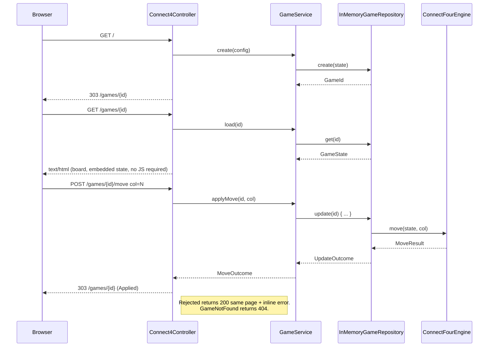
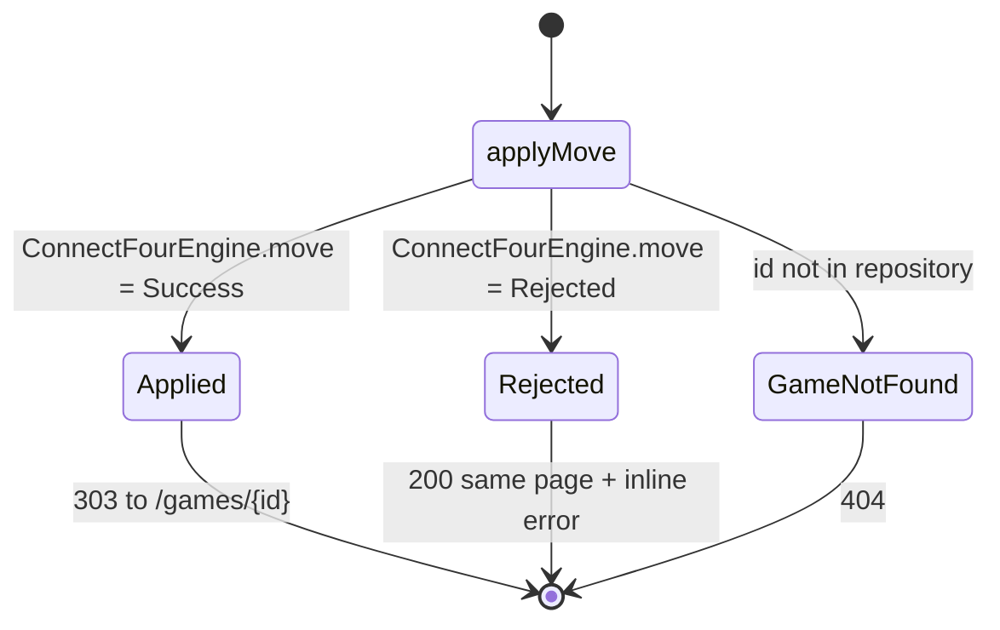
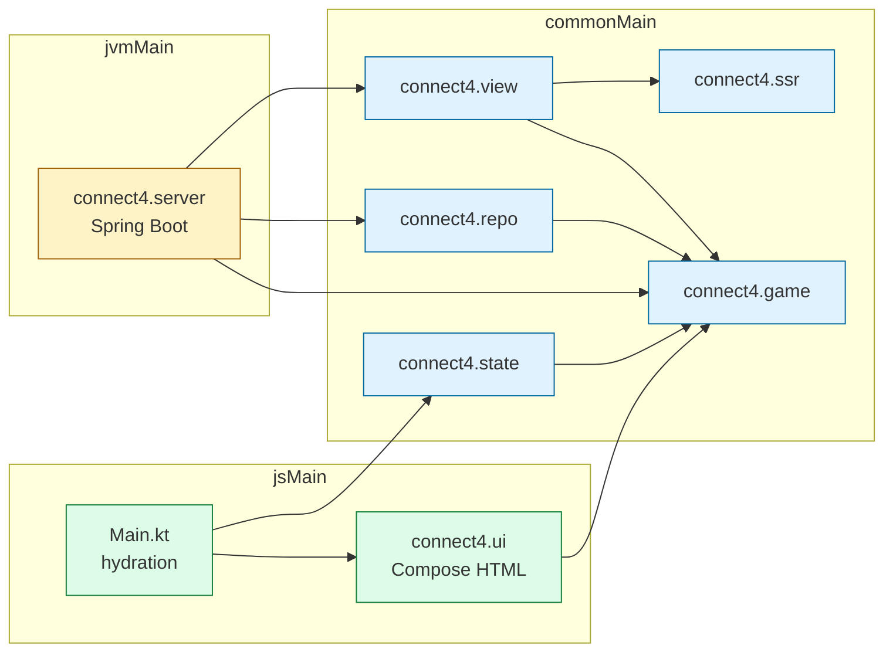

# Connect Four, Compose HTML SSR for Spring

[](https://github.com/lmnst/compose-html-spring-ssr-connect4/actions/workflows/ci.yml)


```kotlin
fun interface View<T> { fun render(model: T): HtmlNode }

object ConnectFourView : View<ConnectFourView.Model> {
    override fun render(model: Model): HtmlNode = html { /* board, status, form */ }
}

val pageHtml: String = DocumentRenderer(ConnectFourView, layout).render(model)
```

A Kotlin Multiplatform Connect Four built around a small **generic
SSR engine**. Spring renders the page on the JVM from a pure `View`
function; with JavaScript on, a Compose HTML client clears `#root`
and renders the board itself. The server view and the client are
two separate renderers, kept aligned by shared class names and one
state codec. The shape is conventional: a Spring controller plus a
server-rendered page. The value is in one decision the design
refuses to bend on.

> **The invariant.** The server holds the canonical state of every
> game in its repository, keyed by an opaque id. Moves are applied
> by the same pure engine the client runs, but the engine consults
> repository-owned state, never a state field on the request body.
> A no-JS player can tamper with form fields all day; they cannot
> forge a board, fast-forward turns, or resurrect a finished game.


## Highlights

- **Generic SSR engine.** `DocumentRenderer<T>` renders any `View<T>`
  in a complete HTML5 document; Connect Four and `/about` share it.
- **Server-authoritative state.** `InMemoryGameRepository` is canonical,
  keyed by an opaque `GameId`; the form posts only the column clicked.
- **No-JS playable.** Each column is a `<button name="col">` inside a
  real `<form action="/games/{id}/move">`; submits become server moves
  through classic **post-redirect-get**.
- **Cross-target hydration codec.** `StateCodec` is dependency-free
  Kotlin in `commonMain`, exercised on both JVM and compiled JS.
- **Spring without `bootJar`.** The Boot plugin does not compose with
  Kotlin Multiplatform; a small `JavaExec` task runs the app instead.
- **Compose without leakage.** The Compose compiler runs only on the
  JS target, so neither runtime nor browser API leaks into `commonMain`.

## Run it

```bash
./gradlew bootRun
```

A full POST-303-GET round trip:

```bash
$ ID=$(curl -sI http://localhost:8080/ | awk -F'/games/' '/^[Ll]ocation/ {print $2}' | tr -d '\r')
$ curl -i -X POST -d "col=3" "http://localhost:8080/games/$ID/move"
HTTP/1.1 303 See Other
Location: /games/m9k3qr1xs7
Cache-Control: no-store

$ curl -s "http://localhost:8080/games/$ID" \
    | grep -oE 'application/x-connect4-state" id="[^"]+">[^<]+'
application/x-connect4-state" id="connect4-initial-state">v1|6|7|4|TWO|O|.....1.|5.3
```

The trailing `5.3` is the row and column of the disc just placed
(zero-indexed; the bottom-right corner is `5.6`). `TWO|O` says it
is now Player 2's turn and the game is ongoing.

## Anatomy of a request

Three pieces of code make the invariant load-bearing rather than
aspirational. Controller-level detail lives in
[ARCHITECTURE.md](ARCHITECTURE.md#request-flows); the one-screen
sketch:



### Server-authoritative repository

`InMemoryGameRepository` keeps every active game's `GameState` in a
`ConcurrentHashMap`, keyed by a 10-char `GameId` from `[a-z0-9]`.
Mutations go through `ConcurrentHashMap.compute`, so a refresh-and-
submit race against the same id serializes at the map entry; different
ids never block each other. The id is the only handle the client has.

### Post-redirect-get loop

`Connect4Controller.applyMove` reads `col` from the form, calls
`GameService.applyMove(id, col)`, and dispatches on a sealed
`MoveOutcome`. The result page is reached via `303`, so refreshing
never re-submits.



### Hydration boundary

`DocumentRenderer<T>` writes the body inside `<div id="root"
data-ssr="1">` next to a `<script type="application/x-connect4-state">`
carrying the encoded state. The Compose HTML client decodes that
script, clears `#root`, and mounts a Compose tree there. The codec is
exercised on **both** targets, so the SSR payload provably decodes the
same way in compiled JS as on the JVM.

## The generic SSR engine

The engine is **not** Connect-Four-shaped. The Connect Four demo is a
small bundle of types layered on top of it.

```kotlin
// Generic, in commonMain/connect4/ssr
sealed interface HtmlNode                           // Element, Text, Fragment
fun html(block: HtmlScope.() -> Unit): HtmlNode     // type-safe DSL
class HtmlRenderer(pretty: Boolean = false)         // emits well-formed HTML

fun interface View<T> { fun render(model: T): HtmlNode }
data class DocumentLayout(val title: String, /* assets, lang, meta */)
fun interface StateEmbedding<in T> { fun encode(model: T): EmbeddedState? }
class DocumentRenderer<T>(view: View<T>, layout: DocumentLayout, stateEmbedding: StateEmbedding<T>? = null)

// Connect-Four-specific, in commonMain/connect4/view
object ConnectFourView : View<ConnectFourView.Model>
object WelcomePageView : View<WelcomeModel>         // proves genericity
class PageRenderer(...)                             // typed wrapper
```

| Type | Role |
|---|---|
| `HtmlNode` | Sealed AST: `Element`, `Text`, `Fragment`. Tag names validated at construction time. |
| `HtmlRenderer` | Depth-first emitter. Escapes text and attribute values. Replaces `</` with `<\/` in `<script>` and `<style>` raw-text contexts so payloads cannot break out. |
| `View<T>` | Pure `T -> HtmlNode`. Platform-agnostic, deterministic. |
| `DocumentRenderer<T>` | Wraps any `View<T>` in an HTML5 document defined by `DocumentLayout`. Optionally plugs in a `StateEmbedding<T>`. |

## Library use

A new view is a model, a `View<T>`, and a `DocumentLayout`. A
hydratable view also supplies a `StateEmbedding<T>`.

```kotlin
data class WelcomeModel(val heading: String, val intro: String)
object WelcomePageView : View<WelcomeModel> { override fun render(m: WelcomeModel) = html { /* ... */ } }

val layout = DocumentLayout(title = "About", styleHref = "/static/connect4.css", scriptSrc = null)
val html: String = DocumentRenderer(WelcomePageView, layout).render(WelcomeModel("hello", "world"))
```

`AboutController` is the production proof: same renderer, same
layout primitives, same test suite, no state embedding, no JS bundle.

## Endpoints

| Method | Path | What it does |
|---|---|---|
| GET | `/` | Create a new game and `303` to `/games/{id}`. Optional `rows`, `cols`, `win`; invalid combinations fall back to 6x7-with-4. |
| POST | `/games` | Form-create a new game. Same redirect. |
| GET | `/games/{id}` | Render the SSR page. 404 if the id is unknown or malformed. |
| POST | `/games/{id}/move` | Apply a move (form param `col`). `303` on success; 200 with inline error on rejection; 404 if gone. |
| GET | `/about` | A non-game SSR page rendered through the same engine, with no JS bundle. |
| GET | `/healthz` | `ok`. |
| GET | `/api/state` | The encoded default initial state, useful for diagnostics and tests. |

`/static/connect4.js` and `/static/connect4.css` are the Compose HTML
bundle and stylesheet, copied into the JVM jar at build time and served
by Spring's default static-resource handler.

## Tests

| Suite | Tests | Run with | What it covers |
|---|---:|---|---|
| Pure engine | 13 | `./gradlew jvmTest` | All four win axes, draw, full-column rejection, configurable win length, gravity. ASCII fixtures, no mocks. |
| SSR engine | 25 | `./gradlew jvmTest` | Escaping, attribute order, void elements; `<script>` break-out attempt verified against rendered output. |
| State codec | 9 | `./gradlew jvmTest` | Round-trips for fresh / mid-game / won; unknown version, truncated, corrupt cells, invalid player and status. |
| Views | 22 | `./gradlew jvmTest` | Default rendering, ARIA labels, full-column disabled buttons, win-line classes, error panel. |
| Repository | 13 | `./gradlew jvmTest` | `GameId` validation; real `Executors.newFixedThreadPool(4)` with 40 concurrent moves, asserting gravity on the resulting board. |
| Service | 6 | `./gradlew jvmTest` | Create / load / applyMove orchestration; the rejected case is exercised against a real engine state. |
| Spring controller | 17 | `./gradlew jvmTest` | Real `@SpringBootTest` + `MockMvc` over every route; isolation between two ids; post-game lockout returns 200. |
| State codec on JS | 6 | `./gradlew jsBrowserTest` | The codec runs in the **compiled JS bundle**; the SSR payload provably decodes the same way in the browser. |

105 JVM tests across 8 suites. The JS target re-runs the engine, SSR,
codec, and view suites in the browser, plus `StateCodecJsTest` for
cross-target codec parity.

## Build

```bash
./gradlew check                           # compile and run all tests
./gradlew bootRun                         # run the SSR server on :8080
./gradlew jsBrowserDevelopmentRun         # CSR-only dev harness for the JS UI
./gradlew jsBrowserProductionWebpack      # build the production JS bundle only
./gradlew jvmJar                          # JVM jar including the JS bundle
```

JDK 17 or newer; the Gradle 8 wrapper is included. The runtime
classpath is Spring Boot starter-web 3.3.5 and `kotlin-reflect` on the
JVM, plus Compose HTML 1.7.3 on the JS browser bundle. `commonMain`
declares zero dependencies. The Spring Boot Gradle plugin is **not**
applied; a `JavaExec` task named `bootRun` runs the app from the JVM
jar plus the JVM runtime classpath. See
[docs/DESIGN.md](docs/DESIGN.md#spring-boot-gradle-plugin-or-a-javaexec-task)
for why.

## Project layout



`commonMain` declares zero dependencies. The Compose compiler is
configured to target the JS platform only, so neither the Compose
runtime nor any browser API leaks into the shared engine.

## Limitations

- **In-memory repository.** Restarting the server clears the registry;
  scaled deployments would need a shared store. The `GameRepository`
  contract is designed so swapping in Redis or Postgres is a one-class change.
- **JS-only configuration.** The rows/cols/win form appears only after
  hydration; SSR first paint is always a playable board for the requested config.
- **Client moves are not synced back.** Once mounted, the Compose
  client plays locally. Synchronizing back to the server is a deliberate
  non-goal: the no-JS path already proves the round-trip works.
- **Partial DSL.** `connect4.ssr` ships only the elements the project uses.

## Reading on

- [ARCHITECTURE.md](ARCHITECTURE.md): request-flow diagrams, source-set
  dependency boundaries, SSR engine internals, hydration rule.
- [docs/DESIGN.md](docs/DESIGN.md): the design forks and the call made
  for each (Compose-on-JVM vs. a generic engine, state in form vs.
  repository, `kotlinx.html` vs. custom DSL, `bootJar` vs. `JavaExec`,
  Compose compiler scope).
- [docs/STORY-SERVER-AUTHORITATIVE.md](docs/STORY-SERVER-AUTHORITATIVE.md):
  how the server stopped trusting the form. The setup, the bug, the
  reflexive fix that was wrong, the structural fix that landed.
- [LICENSE](LICENSE): MIT.
